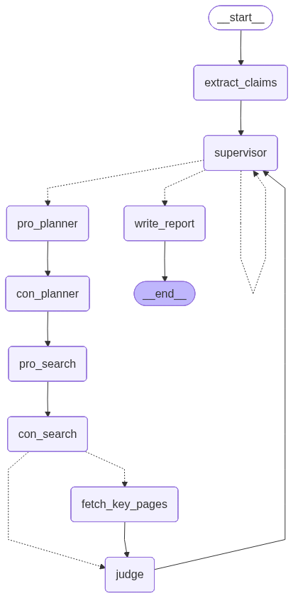

# FactCheck Multi-Agent

A fact-checking agent service built with `FastAPI`, `LangGraph`, OpenAI-compatible LLM calls, and web/RAG retrieval.

The project does not just return a search result. It turns input text into checkable claims, plans evidence collection, runs pro/con retrieval, optionally fetches full pages, judges each claim, and produces a final structured report.



## Features

- Multi-claim extraction from raw input text
- Supervisor-driven graph execution
- Pro/con evidence collection
- Web, RAG, and hybrid retrieval modes
- Optional HTML, plain text, and PDF fetch
- Async task submission and status polling
- Local persistence for run lifecycle data
- Retrieval diagnostics and reranking support

## Project Structure

```text
app/
  agent/
    graph.py
    llm.py
    models.py
    render.py
    state.py
    state_factory.py
    node_handlers/
    prompts/
  core/
    config.py
    logging.py
  services/
    factcheck_runner.py
    factcheck_tasks.py
  storage/
    sessions.py
  tools/
    fetch.py
    rag.py
    retrieval.py
    search.py
    taxonomy.py
  api.py
  main.py
  routes.py
  webui/
docs/
eval/
scripts/
tests/
```

## Requirements

- Python 3.10+
- An OpenAI-compatible chat model
- Tavily API key for web retrieval
- An embedding model if `RETRIEVAL_MODE` uses `rag` or `hybrid`

## Setup

### venv

```powershell
python -m venv .venv
.venv\Scripts\activate
python -m pip install -r requirements.txt
copy .env.example .env
```

### conda

```powershell
conda create -n factcheck-ma python=3.11 -y
conda activate factcheck-ma
python -m pip install -r requirements.txt
copy .env.example .env
```

## Configuration

Minimum required fields in `.env`:

- `MODEL_NAME`
- `LLM_API_KEY`
- `LLM_BASE_URL`
- `TAVILY_API_KEY`

Common optional fields:

- `MAX_CLAIMS`
- `SEARCH_BUDGET`
- `MAX_ROUNDS_PER_CLAIM`
- `ENABLE_FETCH`
- `FETCH_BUDGET`
- `RETRIEVAL_MODE`
- `RAG_BACKEND`
- `RAG_COLLECTION`
- `RAG_TOP_K`
- `RERANK_MODE`
- `RETRIEVAL_DIAGNOSTICS_ENABLED`
- `RAG_INDEX_DIR`
- `RAG_DOCS_DIR`

See [`.env.example`](.env.example) for a full example.

## Run

Start the API server:

```powershell
uvicorn app.main:app --host 127.0.0.1 --port 8000
```

Or:

```powershell
python -m uvicorn app.main:app --host 127.0.0.1 --port 8000
```

After startup:

- `http://127.0.0.1:8000/`
- `http://127.0.0.1:8000/ui`
- `http://127.0.0.1:8000/docs`
- `http://127.0.0.1:8000/graph/mermaid`

### One-click UI Startup

On Windows:

```powershell
.\start_ui.ps1
```

Or double-click:

```text
start_ui.bat
```

## API

### `POST /check`

Submit an async fact-check task and get back a `run_id`.

Example body:

```json
{
  "input_text": "Fact-check this claim: Earth orbits the Sun.",
  "search_budget": 2,
  "max_rounds_per_claim": 1,
  "enable_fetch": true,
  "fetch_budget": 1,
  "max_claims": 1
}
```

### `POST /check/sync`

Run synchronously and return the final response directly.

### `GET /runs/{run_id}`

Check task status and final result.

### `GET /sessions/{session_id}/latest`

Read the latest run inside a session.

### `GET /graph/mermaid`

Return the LangGraph Mermaid representation.

## Minimal Request Example

### PowerShell

```powershell
$body = @{
  input_text = "Fact-check this claim: Earth orbits the Sun."
  search_budget = 2
  max_rounds_per_claim = 1
  enable_fetch = $true
  fetch_budget = 1
  max_claims = 1
} | ConvertTo-Json

Invoke-RestMethod `
  -Method Post `
  -Uri "http://127.0.0.1:8000/check" `
  -ContentType "application/json" `
  -Body $body
```

### curl

```bash
curl -X POST "http://127.0.0.1:8000/check" \
  -H "Content-Type: application/json" \
  -d '{
    "input_text": "Fact-check this claim: Earth orbits the Sun.",
    "search_budget": 2,
    "max_rounds_per_claim": 1,
    "enable_fetch": true,
    "fetch_budget": 1,
    "max_claims": 1
  }'
```

## RAG Usage

To actually use RAG retrieval, you still need to:

1. Set `RETRIEVAL_MODE=rag` or `RETRIEVAL_MODE=hybrid`
2. Configure `EMBEDDING_MODEL`
3. Put corpus files into `RAG_DOCS_DIR`
4. Build the index

```powershell
python scripts\build_rag_index.py --recreate
```

For a one-click Windows bootstrap of the public starter corpus plus index rebuild:

```powershell
.\bootstrap_open_rag.ps1
```

Without those steps, the service still runs but uses web retrieval only.

## Tests

Run the full test suite:

```powershell
python -m unittest discover -s tests -v
```

## Data Output

Runtime data is stored under `data/`, including:

- `data/cache/search`
- `data/cache/fetch`
- `data/sessions`
- `data/rag_index`

These runtime artifacts should not be committed.

## Documentation

- Iteration summary: [`docs/iteration-summary-2026-03-29.md`](docs/iteration-summary-2026-03-29.md)
- Interview deep dive: [`docs/ai-agent-interview-project-deep-dive.md`](docs/ai-agent-interview-project-deep-dive.md)
- Open corpus bootstrap: [`docs/open-corpus-bootstrap.md`](docs/open-corpus-bootstrap.md)
- RAG complete summary: [`docs/rag-complete-summary.md`](docs/rag-complete-summary.md)
- RAG Phase 1: [`docs/rag-phase-1-summary.md`](docs/rag-phase-1-summary.md)
- RAG Phase 2: [`docs/rag-phase-2-summary.md`](docs/rag-phase-2-summary.md)
- RAG Phase 3: [`docs/rag-phase-3-summary.md`](docs/rag-phase-3-summary.md)
- RAG Phase 4: [`docs/rag-phase-4-summary.md`](docs/rag-phase-4-summary.md)
- RAG Phase 5: [`docs/rag-phase-5-summary.md`](docs/rag-phase-5-summary.md)
- RAG Phase 6: [`docs/rag-phase-6-summary.md`](docs/rag-phase-6-summary.md)

## Current Limits

- The task worker is still in-process and best suited for local or single-instance deployment
- Retrieval and fetch ranking still rely partly on heuristics
- RAG only becomes active after corpus ingestion and index build
- The project is optimized for fact-check workflows, not general chat QA
